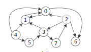
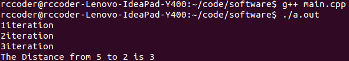

README.md
===
数据文件
---
a.txt

如何运行
---

```
g++ main.cpp
(chmod +x ./a.out)
./a.out
```
运行环境
---
Ubuntu 15.04

gcc 4.9.2

**数据说明**
```
8 13
0 1 1
0 6 1
……
5  2
```
上述数据含义如下：

**8**-图有8个顶点

**12**-图有12条边

**0 6 1**-0点到6点有条长度为1的v边

**5 2** -求5点到2点的距离

**输入说明**

上述数据说明中输入的输入为下图：



** 输出说明**

代码中对多余的输出均进行了注释，如果想查看可以去掉相应的注释，现只输出迭代的次数与最后两点之间的距离。

输出截图如下：



