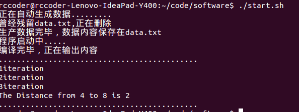
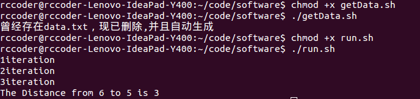

README.md
===
数据文件
---
data.txt

a.txt(静态数据，验证正确性用)

如何运行
---
**直接运行**
```shell
chmod +x ./start.sh
./start.sh
```
** 两步运行**

*1.生成data*
```shell
chmod +x ./getData.sh
./getData.sh
```
*2.编译运行*
```shell
chmod +x ./run.sh
./run.sh
```
运行环境
---
Ubuntu 15.04

gcc 4.9.2

*没有测试windows环境脚本是否可以正确运行，如果不能正确运行，可将data.cpp的输出结果输出到data.txt，然后再编译运行main.cpp*

**数据说明**
```
8 13
0 1 1
0 6 1
……
5  2
```
上述数据含义如下：

**8**-图有8个顶点

**12**-图有12条边

**0 6 1**-0点到6点有条长度为1的v边

**5 2** -求5点到2点的距离


** 输出说明**

代码中对多余的输出均进行了注释，如果想查看可以去掉相应的注释，现只输出迭代的次数与最后两点之间的距离。

输出截图如下：

***1.直接运行***



***2.两步运行***



**正确性检验**

a.txt中保存的图转换为真实图像为下图：


默认输出结果如下：


可对他进行特定的输入与输出来检验程序的正确性，需改动main.cpp里面main函数的输入文件为a.txt(原data.txt)。求其他两点的最小距离需改动a.txt里面的最后一行（格式详见数据说明）。